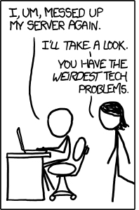

# Blog Outage: Post-Mortem Report

    

## Introduction

This report details a recent outage that affected our website's blog functionality. It outlines the cause of the issue, the implemented solution, and preventive measures taken to minimize future occurrences.

## Incident Summary

On Wednesday, June 19th, 2024, between 10:20 AM and 11:10 AM EAT (GMT+3), our blog experienced an outage. Visitors attempting to access the blog encountered a "500 Internal Server Error," resulting in a 100% failure rate.

## Timeline

- **10:00 AM:** A configuration change was deployed to the blog environment.
- **10:10 AM:** Initial reports of blog inaccessibility surfaced from visitors.
- **10:23 AM:** All requests to the blog resulted in failures.
- **10:25 AM:** The Site Reliability Team was notified of the outage.
- **11:00 AM:** The root cause, a configuration error, was identified and rectified.
- **11:05 AM:** The corrected configuration was redeployed.
- **11:10 AM:** Blog functionality was restored.

## Root Cause Analysis

An inconsistency within the WordPress configuration file (wp-settings.php) caused the issue. The faulty configuration referenced a file with an incorrect extension (.phpp instead of the expected .php). This error was pinpointed by examining system call logs generated by the strace tool.

## Resolution

The solution involved a simple modification within wp-settings.php. The incorrect extension was replaced with the correct one (.php), followed by a server restart to implement the changes.

## Preventative Measures

To mitigate similar configuration-related errors in the future, we've developed a script to automatically verify the integrity of our WordPress configuration files. This script will be integrated into our deployment process to proactively identify and prevent potential issues.

## Conclusion

The blog outage resulted in a temporary period of inaccessibility for visitors. We implemented a swift resolution and have taken steps to minimize the likelihood of similar occurrences in the future. We continuously strive to improve our website's reliability and user experience.
